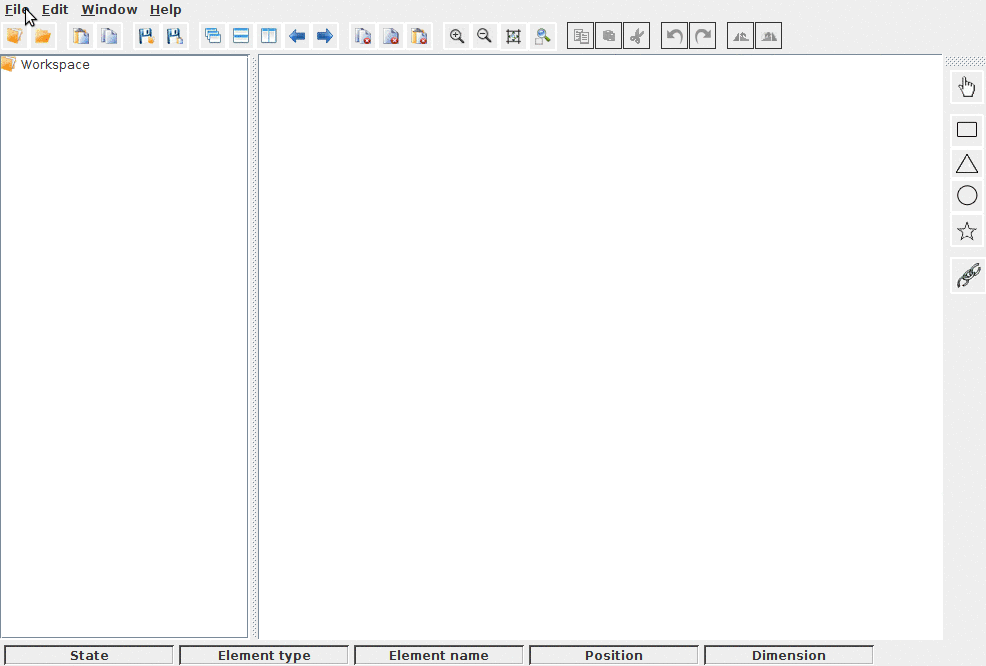

# Graphic-Editor
Simle graphical editor with full of possibilities implemented "from Zero" with java swing

  

## Easy Run Instructions ( For non-developers )

Follow these instructions if you simply wish to run Graphic-Editor

**Prerequisites:** 

Java VM >= 1.6 installed ( JDK 1.7 recommended)

1. Download the executable jar file to any location of your choice:

    (https://github.com/SKantar/Graphic-Editor/blob/master/GraphicEditor.jar)

2. Run it using java:

    > java -jar GraphicEditor.jar

##  Standard Run Instructions (For Developers)

Follow These instructions if you wish to run Graphic Editor and modify the source code
as well.

**Prerequisites:**

* Java >= 1.6 ( JDK 1.7 recommended )
* Eclipse Java IDE

**Note:** Graphic-Editor source code can be downloaded at: (https://github.com/SKantar/Graphic-Editor/tree/master/Graphic%20editor).

1. Download project to any location of your choice
2. After opening the project in Netbeans or Eclipse, you can easily run the project

## Commands
Try all possibilities
